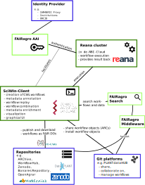

<!-- The cutomized by-line -->
\setlength{\topskip}{1.5cm}
\renewcommand\Authands{\normalfont\small \ and }
\renewcommand\Authfont{\scshape\small}
\renewcommand\Affilfont{\normalfont\footnotesize}
\author[1]{Harald von Waldow \orcidlink{0000-0003-4800-2833}}
\author[1]{Jens Krumsieck \orcidlink{0000-0001-6242-5846}}
\author[2]{Antonia Leidel \orcidlink{0009-0007-1765-0527}}
\author[2]{Patrick König \orcidlink{0000-0002-8948-6793}}
\affil[1]{Johann Heinrich von Thünen Institute, Braunschweig}
\affil[2]{ Leibniz Institute of Plant Genetics and Crop Plant Research (IPK), Gatersleben}

\maketitle
\vspace{-1cm} 

<!-- The logo in the top left corner -->
\tikz[remember picture,overlay,x=\paperwidth,y=\paperheight]{%
    \node[anchor=north west, inner sep=0pt]
    at ($(current page.north west)+(.5cm, -.5cm)$) {\includegraphics[width=5cm]{Fairagro_Logo_linksbuendig_Verlauf.png}};}

## Thematic note

This text is deliverable D4.4.1 of Measure 4.4. in Task Area 4 of the NFDI
consortium FAIRagro. "SciWIn" stands for **Sci**entific **W**orkflow
**In**frastructure and denotes the overall delivrable of Measure 4.4. This
document concludes Action 1 of Measure 4.4. The title set forth in the proposal
[@ewert2023] was "Joint concept of SciWIn as part of the RDC semantic toolset"
Several assumptions made at the time of writing the proposal did not
materialize. It was therefore necessary to adapt the direction of the project
and consequently the thrust of its conceptualization.

### The missing Research Data Commons

The proposal foresaw the integration of SciWIn into a joint infrastructure
involving in particular an "RDC mediation layer" [@ewert2023], where "RDC" stands for
"Research Data Commons".
RDC was anticipated to become "an overarching virtual expandable infrastructure" [@glockner2020] hosting "cross-cutting services for the NFDI" [@bierwirth2020].
While @glockner2020 and @bierwirth2020 are mere declarations of intent,
the consortium NFDI4BioDiversity proposed to establish RDC as a cloud-based research 
infrastructure
and provided a high-level architectural layered concept for RDC [@glockner2020a]
into which SciWIn was supposed to be integrated.

In addition to "RDC" as infrastructure, the term "RDC" was also used in the FAIRagro 
proposal in the sense of a set of criteria that services should fulfil be be interoper
able with the NFDI-wide infrastructure. It was proposed that "FAIRagro will comply wit
h the NFDI-RDC" and that "Storage Instances [of M4.4] ... will hold RDC-compliant FAIR
 DOs ..."

In June 2024 we organized a meeting with stakeholders from NFDI4Biodiversity, which w
ere involved in the design and
implementation of the NFDI4BioDiversity-specific RDC (Bio-RDC).
It turned out that at that point in time, RDC existed as "a blueprint", an "architectural model" and a collection of specfic individual services, namely

 + An image annotation software, [BIIGLE](https://biigle.de/)
 + The terminology-related [BiodivPortal](biodivportal.gfbio.org) (not reachable at
   the time of writing)
 + A search engine for biological data [GFBio Search](https://search.gfbio.org/)
 + An object storage technology, [Aruna](https://aruna-storage.org/)
 + An AAI-provider, [Life Science Login](https://lifescience-ri.eu/ls-login/) by
   EOSC-Life
 + A KPI monitoring service, [Scorpion](https://scorpion.bi.denbi.de/)

The conceptual ideas had no actionable specification or reference implementation
and also seemed to be still in flux. A move to a more domain-oriented
decentralized architectural paradigm (["data mesh
concept"](https://www.datamesh-architecture.com/)) was considered. The six
approved R DC services on the other hand did not bear direct touching points
with SciWIn or FAIRagro. A list of criteria that services should fulfil in order
to be "RDC compliant" was planned by TA4 of NFDI4Biodiversity but not yet
published.

### Changed Directions

Under these circumstances we had to deal with the fact that there did not exist
an "RDC" or an "RDC semantic toolset" into which SciWIn could have been
meaningfully integrated. Also the realization of such a thing did not seem
likely in a timeframe that would allow to take it into account in the planning
and design of SciWIn. Another consequence of the lack of RDC or a clear path
towards its realization was the lack of FAIRagro external cooperation partners
to develop a "joint concept" with respect to "the RDC semantic toolset".

In order to stay true to the spirit of this action as originally considered, we
developed a set of goals to capture the essence of Action 1. Drawing from
@bierwirth2020, @glockner2020 and @diepenbroek2023, we defined characteristics that
would 1) increase the chance for SciWIn to become a part of an NFDI-RDC if that
concept were actually implemented, and 2) maximize cross-domain usage,
usefulness and synergies in any case:

1. While primarily use-cases and requirement from the agrosystem science
   community drive SciWIn's developent in FAIRagro, it should nevertheless be
   domain-agnostic and potentially unleash its full potential also in other
   quantitative research domains.
2. SciWIn tools and services should be easily accessible for researchers from
   other NFDI concortial and other domains in general. 
3. SciWIn should be based on data formats and protocols that are well
   established, domain-agnostic and future-proof to maximize the chances for
   wide adoption and interoperability.
4. SciWIn should actively exploit existing servcies and services that are currently  
   being developed
   + to avoid re-invention of the wheel,
   + to increase development efficiency and
   + to be exposed early on to the greater research ecosystem

## SciWIn components - Overview

The original idea of the SciWIn design, as laid out in an ecosystem map
[@ewert2023, Figure 16] features five components:

1. An AAI provider,
2. The "Workflow Hub",
3. Compute instances,
4. Storage instances, and
5. Workflow Objects

![Original ecosystem idea for SciWIn [Figure 16 from @ewert2023]](oldsystem.png){width=15cm}

## Nomenclature refinements

In that conceptualization, only the "Workflow Hub" was supposed to be developed as a dedicated
infrastructure item by SciWIn, while the other components are existing services that communicate with
the “Workflow Hub”. The main purpose of the "Workflow Hub" was the provision of "an easy-to-use
interface to work on and create new FAIR DO outputs with automatically annotated provenance
graphs". "FAIR DO" stands for "FAIR Digital Objects", which is used for a quite abstract concept in
the current literature. @schultes2019 state that FAIR Digital Objects "represent data,
software or other research resources" and "must be accompanied by persistent identifiers, metadata
and contextual documentation to enable discovery, citation and reuse". We slightly modify and
sharpen and the meaning of the terms "FAIR DO" and "Workflow Object" for use in SciWIn and at
the same time adapt their semantics to better fit the current implementation strategy:

FAIR DO:

: A serializable object that adheres to the definition of @schultes2019 above.
This also implies that a FAIR Do resides in a suitable FAIR repository that
provides discovery and citeability.

Workflow Object:

: A data structure that holds a definition of a computational workflow,
associated data and software or pointers to them, along with provenance and
version information for all these objects. The Workflow Object can be consumed
by an execution engine, which then might return the Workflow Object amended with
results of the execution of a computational workflow.

## Re-conceptualization of the "Workflow Hub"

Realizing that the main challenge to be solved lies in the provisioning of
tooling for the easy creation of workflows, this task is now assigned to a
stand-alone program that scientists use at their workstations in their daily
habitual work without requiring internet-access, a central service, or
authorization. This stand-along program is called **SciWIn-Client**. The program
supports not only the creation but also the management of all aspects of
Workflow Objects containing computational workflows. In particular, it
facilitates sharing of and collaboration on Workflow Objects by providing import
and export functions to suitable platforms.

The second important function of SciWIn-Client is the communication with compute
instances to enable scientists to submit computational workflows for remote
execution and fetch the results. SciWIn-Client thus implements the functionality
that was assigned to "Workflow Hub" in the initial sketch in the proposal.

As a program that anybody can install on their computer, SciWIn-Client does not
need an authentication service.

## Re-conceptualization of "Storage Instances"

The "Storage Instances" mentioned in the proposal that still exist are
[e!DAL-PGP](https://edal-pgp.ipk-gatersleben.de/) and the [BonaRes
Repository](https://maps.bonares.de/mapapps/resources/apps/bonares/index.html?lang=en).
Those are established research repositories, just like
[OpenAgrar](https://www.openagrar.de) or [Zenodo](https://zenodo.org/), that
serve a wide range of research communities and users and have their own set of
challenging requirements. "Storage Instances" in that sense are called
"Repositories" from here on. They are run and operated by independent entities
who in general have no interest to invest resources into fulfilling very
specific requirements of FAIRagro. Therefore they are not suited to FAIRly
realize the full potential of re-usable, re-combineable, modular computational
workflows. The existing repositories are still useful in this context to publish
workflows as citeable scientific output that is reliably preserved over long
time-spans. However, a programmatically driven, non interactive submission of
content is not possible with such repositories, and sometimes even reading data
requires interactive operation. We therefore refrain from a tight technical
integration of such repositories into SciWIn. We do expect that users search and
find data and code in such repositories, ideally even packaged as a FAIR DO that
can be consumed directly by SciWIn. Search of and access to some of those
repositories, covering specific needs of FAIRagro and the agrosystem research
community is provided by the products of M4.2 and M4.3, the "Middleware" and the
"Search Service", respectively. We consider features for SciWIn-Client that ease
the publication of Workflow Objects to such repositories by providing prompting
for required metadata and specific formatting of such metadata for selected
repositories. In that context we also consider more domain and/or workflow
specific repositories such as [Workflow Hub](https://workflowhub.eu) or
[ARChive](https://archive.nfdi4plants.org).

While such repositories are suited to publish FAIR DOs which have reached a
certain level of quality, are sufficiently annotated with metadata and should be
re-usable by researchers outside the lab or project where they originated, our
idea of SciWIn also includes a way to share workflows, or more precisely
Workflow Objects in a more ad-hoc, intermittent, less formal, easy manner that
supports seamless cooperation but doesn't aim at producing citeable scientific
output. As will become clear in the following section, any webservice that
provides access to Git repositories will work for that purpose. Institutional
installations of servcies such as [GitLab](https://gitlab.com/gitlab-org/gitlab)
or [Forgejo](https://forgejo.org/), or even commercial platforms such as
[Bitbucket](https://bitbucket.org/), [GitLab.com](https://gitlab.com) or
[GitHub](https://github.com/) can be used.

## Concretization of "Workflow Objects"

Workflow bjects in the SciWIn-context are data structures that encapsulate the
definition of workflows with associated code and data or references to code and
data. Since a close collaboration between FAIRagro and NFDI Consortium DataPLANT
is established on different levels, we have taken into account their version of
a Workflow Objects, the **Annotated Research Context (ARC)** [@dataplant205],
and the established standards on which it is based. These are the **Common
Workflow Language** [@crusoe2022] to specify computational workflows and the
**Research Object Crate** [RO-Crate, @soiland-reyes2022] as a data structure to
package data (which here also includes code and workflow descriptions) into
which ARCs can be converted. While compatibility with the advanced tooling and
infrastructure of DataPLANT is an important piece to achieve synergies with this
consortium covering a neighboring research domain, CWL and RO-Crate represent
the state-of-the art for workflow descriptions and semantically annotated
metadata formats. Therefore, they are also used or considered by other NFDI
consortial, e.g. NFDI4Ing [@bronger2022] and NFDI4Health [@lobe2024].
Furthermore, the semanitic annotation of metadata allows for the integration of
such Workflow Objects into knowledge graphs that interconnect different domains.

ARCs are Git repositories and therefore contain the version history of code,
data and metadata. While ARCs allow for workflow represenations as CWL, they do
not require the representation of the full provenance information of a
workflow's elements. M4.4 aims to work with DataPLANT towards a common ARC
specification and its corresponding RO-Crate profile, so that both, DataPLANT's
compatibilty requirements with related standards such as the ISA-model
[@sansone2016] and the usability and workflow-representation requirements of
SciWIn are met.

## Implementation of Compute Instances

The choice of CWL as workflow description language ensures that workflows
created by SciWIn can be executed on a broad range of platforms
[@cwlimplementations2025]. However, many of these platforms require significant
ressources for setup and operation. Different platforms have different sets of
compute backends, such as HTCondor, AWS, Azure, SLURM and Kubernetes.
Additionally, the interaction with remote **compute instances** differs from
platform to platform. Therefore, in order to experiment with remote execution of
workflows and be able to pilot the whole range of SciWIn functionality, we have
settled on **Reana** [@simko2019] as primary execution platform. Originating
from CERN, Reana is widely used and under active development since 8 years. Our
main reason to settle on Reana however was the fact that NFDI4PUNCH provided us
simple access to an instance at the Leibniz-Institute for Astrophysics Potsdam
through an informal collaboaration. Furthermore, the BASE4NFDI project MC4NFDI
(​_A Multicloud Infrastructure for the NFDI_) would have ensured robust,
well-integrated access to Reana clusters for users of SciWIn. Unfortunately, the
MC4NFDI proposal was rejected in the 7th submission round.

**Access** to SciWIn-Hub and other services, such as the _FAIRagro Searchable
Inventory of Services and Data_ [@ewert2023, pp. 94-96] and compute instances,
will be managed by the NFDI-wide Base4NFDI project IAM4NFDI, that is supported
by the Working Group Identity and Access Management [@pempe2022]. Integration of
this AAI solution into FAIRagro is performed by FAIRagro Measure 4.2.
**SciWIn-Client** will implement the respective authorization protocol.

{ width=15cm}

The main areas of activity of Measure 4.4 / SciWIn can therefore be listed as follows:

1. **The SciWIn-Client**
  - effortless recording of computational workflows in CWL
  - local and remote execution of computational workflows
  - local management of multiple workflows
  - import of workflows from remote sources
  - export of workflows to remote targets
  
2. **SciWIn-Hub**
  - sharing of computational workflows (up- and download)
  - authorization against an AAI
  - make workflows available for harvesting by FAIRagro-Search / Middleware
  - stage workflows for publication on platforms such as [workflowhub.eu](workflowhub.eu), [https://workflow.earth/](https://workflow.earth/), [zenodo.org](zenodo.org).
  - visualization of workflow-graphs
  - graphical selectiona and manipulation
  
3. **Reana cluster**
  - Remote execution of computational workloads
  - Capturing of output to produce complete Workflow Run RO-Crates [WRROC, @leo2024]
  - Access management for computational ressources

## SciWIn components - details

### Requirements

In proposal driven software development, the textbook recipes for requirements
engineering do not work out of the box, since the usual stakeholder-structure is
not present. In particular, a priory there are no "users" or "customers" that could be queried for requirements. Consequently, the acquisition of users has to be part of the project.

**The overarching goal or business case** of SciWIn as specified by the
FAIRagro-proposal [@ewert2023] is it to "promote FAIR RDM" by facilitating the
reproducibility, the deployment and the publication of data analysis workflows
and simulation models.

**FAIRagro-intrinsic requirements**

Sources for intrinsic requirements are:
 - Measure-inernal brainstorming regarding personal goals of the developers
 - regular meetings with colleagues in Task Area 4 
 - meetings with colleagues from other Task Areas
 - feedback from the Community Advisory Board
 
 While these requirements are not elicitated in a systematic fashion, are
 expressed subjectively by various individuals and might change over time or
 assume changing priorities, at the time of writing we identify the following
 non-functional requirements for the software-output of Measure 4.4:
 
 1. demonstration of a PoC
 2. attract real use cases
 3. create synergies with other consortia and other external projects
 4. generate publications
 5. adoption of the software in multiple domains
 6. demonstration of research output that was made possible by use of SciWIn
 7. 
 
 **User requirements**
 
 In lieu of collecting requirements from the future users that can be found
 through a customer relationship as in traditional software engineering [see
 e.g. robertson2024], we initially rely on requirements that we devise ourselves, based on
 our personal and consulting experience with regard to scientific computing and
 research data mangement. User requirements might be summarized as
 
 1. create machine readable workflow descriptions
 2. integrate naturally into a common comman-line interface oriented style of interactive work
 3. have a low threshold of learning before scintific work efficiency increases
 4. provide an easy overview of numerous versions, runs, inputs, outputs
 5. provide an easy way to annotate worflows for re-used
 6. allow to annotate workflows for publication
 7. provide a way to publish workflows
 8. provide a frictionless way to access remote (powerful) computing ressources
 9. provide a tool to 
 
 

easy-to-use interface  to work on and create new FAIR DO outputs with automatically annotated provenance graphs

### SciWIn client

+ 
+ stakeholders
  + target group
+ functional requirements
+ non-functional requirements
+ tech stack
+ use cases

+ A client-part that works de-centralized, independent of any central infrastructure
  as part of the scientists' daily toolset.
+ Serves to capture computational workflows with minimal effort in a standards
  compliant way.

#### conceptual challenges

remote execution Reana wegen Multicloud
workflow & data
remote reference
dockerization

### Selection of CWL

### SciWIn-Hub

In progress 
+ requirements
+ target group
+ tech stack
+ use cases

+ "CWL package manager"
+ Visualisierung von Workflows
+ cordra ...

## Development Strategy

The development strategy for SciWIn follows a pragmatic, research-oriented approach that prioritizes reproducibility, interoperability, and ease of adoption by the scientific community. Based on the implementation of the SciWIn-Client as evidenced in the fairagro/m4.4_sciwin_client repository, several key strategic decisions have shaped the project's development trajectory.

### Technology Stack and Language Choice

The selection of Rust as the primary programming language for SciWIn-Client represents a strategic decision to balance performance, safety, and cross-platform compatibility. Rust's memory safety guarantees eliminate entire classes of runtime errors that are common in scientific computing environments, while its zero-cost abstractions ensure optimal performance for computationally intensive workflow operations. The language's robust package management system (Cargo) facilitates modular development and dependency management, crucial for a tool that must integrate with diverse scientific computing environments.
### Modular Architecture Strategy

The SciWIn-Client employs a modular workspace architecture that separates concerns into distinct crates, enabling independent development and testing of different functionalities. This architectural decision supports:

- **Maintainability**: Individual components can be updated and tested in isolation
- **Extensibility**: New workflow formats and execution backends can be added without affecting core functionality
- **Reusability**: Core components can be leveraged by other projects within the FAIRagro ecosystem

### Standards-Based Interoperability

A cornerstone of the development strategy is the adoption of established, domain-agnostic standards rather than proprietary formats. The implementation of Common Workflow Language (CWL) as the primary workflow description format ensures broad compatibility with existing workflow execution platforms. This standards-based approach addresses the project's goal of cross-domain applicability and reduces the risk of vendor lock-in or format obsolescence.

### Developer Experience and Accessibility

The development strategy emphasizes lowering barriers to adoption through intuitive command-line interfaces and comprehensive tooling. The SciWIn-Client provides researchers with familiar Git-like workflow tracking capabilities, allowing them to leverage existing version control knowledge. The tool's design philosophy prioritizes:

- **Minimal learning curve**: Familiar command patterns and clear documentation
- **Offline capability**: Core functionality works without internet connectivity
- **Platform independence**: Cross-platform support through Rust's compilation targets

### Quality Assurance and Testing Strategy

The project implements a comprehensive testing strategy using Cargo's built-in testing framework, with both unit and integration tests ensuring reliability across different operating systems and workflow configurations. The dual-licensing approach (Apache 2.0 and MIT) reflects a commitment to open science principles while providing flexibility for different institutional requirements.

### Incremental Development and Community Engagement

The development follows an incremental approach, with early releases focusing on core functionality and subsequent versions adding advanced features based on user feedback. The GitHub-based development workflow enables transparent community involvement and contribution, supporting the broader NFDI goal of collaborative infrastructure development.

### Integration Strategy

Rather than developing isolated tools, the SciWIn development strategy emphasizes integration with existing scientific computing infrastructure. This includes compatibility with container technologies, support for various execution backends, and design considerations for future integration with Base4NFDI services such as IAM4NFDI for authentication and authorization.

The overall development strategy positions SciWIn as a bridge between researchers' local development environments and distributed computing resources, supporting both current scientific workflows and future infrastructure developments within the NFDI ecosystem.

## Interaction within FAIRagro

SciWIn's integration within the FAIRagro ecosystem is designed to create synergies across multiple measures and task areas while supporting the consortium's overarching goals of FAIR data management and reproducible science. The interaction strategy encompasses technical integration, user support, and collaborative development approaches.

### Technical Integration with FAIRagro Infrastructure

**Search and Discovery Integration**: SciWIn workflows are designed to be discoverable through the FAIRagro Searchable Inventory of Services and Data [@ewert2023, pp. 94-96]. The standardized metadata format based on RO-Crate enables automated harvesting and indexing of workflow descriptions, making computational processes findable alongside datasets. This integration ensures that researchers can discover not only relevant data but also the computational methods used to process and analyze it.

**Middleware Connectivity**: Through Measure 4.2's service middleware components, SciWIn-Client interfaces with FAIRagro's broader service ecosystem. This includes authentication and authorization services that will be provided by Base4NFDI's IAM4NFDI, enabling seamless access to protected computational resources and data repositories within the consortium.

**Data Repository Integration**: While existing FAIRagro data repositories (e!DAL-PGP, BonaRes, Thünen-Atlas) serve as long-term preservation systems for workflow outputs, SciWIn-Hub provides the complementary functionality of active workflow sharing and collaboration. This dual approach ensures both the permanence required for scientific reproducibility and the agility needed for active research collaboration.

### User Support and Community Engagement

**Helpdesk and Support Services**: SciWIn benefits from and contributes to FAIRagro's distributed support model. Domain experts within the consortium provide specialized guidance on workflow development for specific agricultural and environmental research contexts, while the SciWIn development team offers technical support for tool usage and integration challenges.

**Training and Capacity Building**: The SciWIn team actively participates in FAIRagro's training and outreach activities, developing educational materials and conducting workshops that demonstrate the integration of workflow management with FAIR data principles. These activities target different user groups, from individual researchers to institutional data managers, ensuring broad adoption across the agrosystem science community.

**Use Case Development**: Collaboration with FAIRagro's domain working groups has yielded concrete use cases that drive SciWIn's development priorities. These include scenarios such as multi-site agricultural modeling, environmental monitoring data processing, and cross-scale analysis workflows that combine field observations with satellite data. Each use case informs both technical requirements and user experience design decisions.

### Collaborative Development and Governance

**Cross-Measure Collaboration**: SciWIn development involves close coordination with other FAIRagro measures, particularly Measure 3.5 (FAIR Digital Objects) for metadata standards, Measure 4.2 (service middleware) for infrastructure integration, and various domain-specific measures for use case validation and requirements gathering.

**Community Feedback Integration**: The open development model of SciWIn incorporates feedback from the broader FAIRagro community through regular demonstration sessions, user testing programs, and participation in consortium-wide technical discussions. This collaborative approach ensures that development priorities align with actual research needs across the diverse FAIRagro partner institutions.

**Standards Harmonization**: SciWIn actively participates in FAIRagro's efforts to harmonize metadata standards and interoperability protocols across the consortium. The adoption of CWL and RO-Crate supports this harmonization while enabling integration with tools and services developed by other measures.

The interaction model positions SciWIn not as an isolated tool but as an integral component of FAIRagro's research infrastructure, supporting the consortium's mission of enabling FAIR and reproducible agrosystem science through enhanced computational workflow capabilities.

## Interaction within NFDI and beyond

+ BASE4NFDI (KG4NFDI, MC (Reana), IAM4NFDI)

## Towards the establishment of SciWIn as a common tool for computational workflows

Use cases,
Outreach
Workshop,
Identify other consortia to co-operate
reach out to other communities

